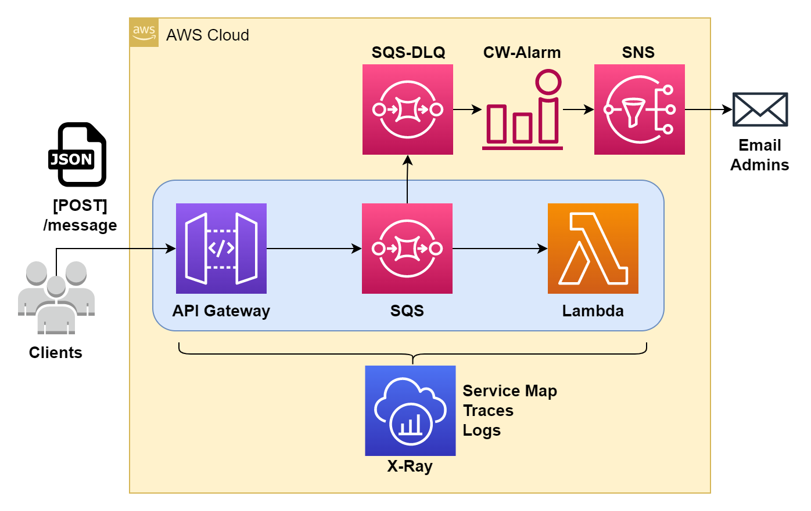
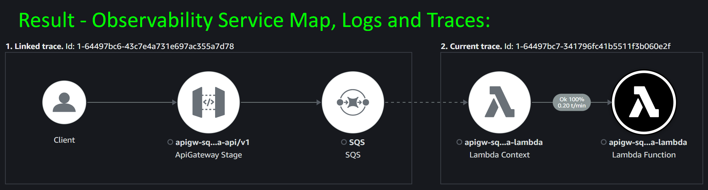
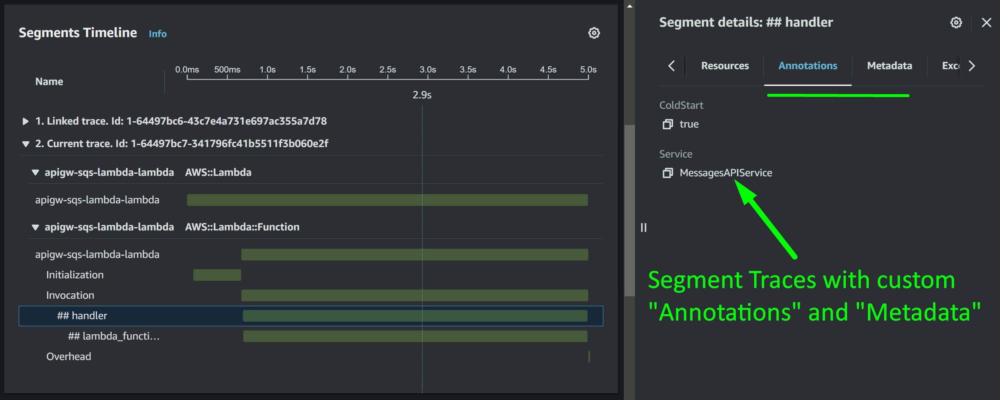
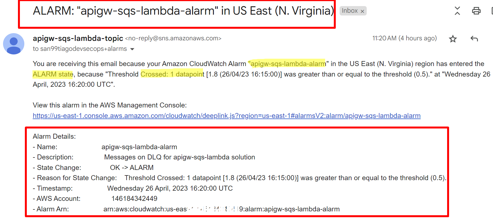
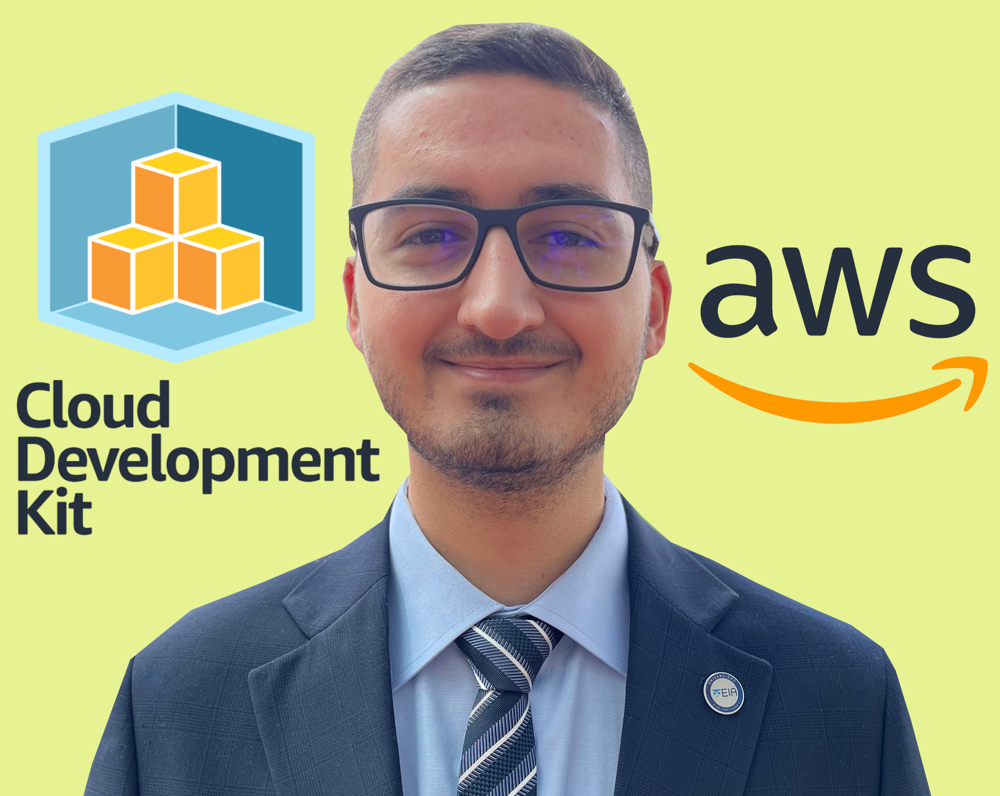

# :incoming_envelope: AWS-CDK-APIGW-SQS-LAMBDA :incoming_envelope:

Serverless AWS architecture to simulate the processing of transactional "messages".  

- Designed with API Gateway on top of SQS and Lambda. Equipped with Observability capabilities including detailed logs, traces and service map on X-Ray.
- Deployed on AWS with Infrastructure as Code on [CDK-Python](https://aws.amazon.com/cdk/) (see [`./cdk`](cdk/) folder).
- Logging and traces enabled with [Lambda PowerTools](https://github.com/awslabs/aws-lambda-powertools-python) and optimized with their latest Lambda Layer.
- Backend processing has SQS-retries and eventual failures (SQS-DLQ) trigger a CW-Alarm and an Admin-Email is sent via a custom SNS-Topic.
- The source code for the Lambda Function is a "dummy processing" approach, but can be extend to any business logic needs.

## AWS Architecture Diagram

The AWS infrastructure solution is deployed with CDK-Python with the resources defined on the `cdk` folder:

  

---

## Observability Results

Any transactional application requires production-level observability, and, for this architecture, it's designed as follows:

### Observability: Service Map

  

### Observability: Service Traces

  

### Observability: CW-Alarm + SNS-Topic Email

  

---

## Dependencies

### AWS CDK

[AWS Cloud Development Kit](https://aws.amazon.com/cdk/) is an amazing open-source software development framework to programmatically define cloud-based applications with familiar languages.  

My personal opinion is that you should learn about CDK when you feel comfortable with cloud-based solutions with IaC on top of [AWS Cloudformation](https://aws.amazon.com/cloudformation/). At that moment, I suggest that if you need to enhance your architectures, it's a good moment to use these CDK-based solutions.  

The best way to start is from the [Official AWS Cloud Development Kit (AWS CDK) v2 Documentation](https://docs.aws.amazon.com/cdk/v2/guide/home.html).  

### Software dependencies

- [Visual Studio Code](https://code.visualstudio.com/)  
  Visual Studio Code is my main code editor for high-level programming. This is not absolutely necessary, but from my experience, it gives us a great performance and we can link it with Git and GitHub easily.  

- [NodeJs](https://nodejs.org/en/)  
  NodeJs is a JavaScript runtime built on Chrome's V8 JavaScript engine programming language. The community is amazing and lets us handle async functionalities in elegant ways.  

- [Python](https://www.python.org/)  
  Python is an amazing dynamic programming language that let us work fast, with easy and powerful integration of different software solutions.  

### Libraries and Package dependencies

- [CDK CLI (Toolkit)](https://docs.aws.amazon.com/cdk/v2/guide/cli.html)  
  To work with the CDK, it is important to install the main toolkit as a NodeJs global dependency. Please refer to the official AWS [Getting started with the AWS CDK](https://docs.aws.amazon.com/cdk/v2/guide/getting_started.html) 

## Usage

Project deployment/destroy commands are explained in detail at [`./important_commands.sh`](important_commands.sh), including the necessary steps to configure CDK and do the deployments.  

## Special thanks

- Big thanks to all the folks who worked hard on these awesome OpenSource projects that I'm using.  

## Author :musical_keyboard:

### Santiago Garcia Arango

The information of this repository is based on many online resources, so feel free to use it as a guide for your future projects!  

<table border="1">
    <tr>
        <td>
            

        </td>
        <td>
            
As a Senior DevOps Engineer, I am deeply passionate about implementing cutting-edge cloud-based solutions on AWS.  I firmly believe that today's greatest challenges must be solved by the expertise of individuals who are truly passionate about their work.
            

        </td>
    </tr>
</table>

## LICENSE

Copyright 2023 Santiago Garcia Arango.
